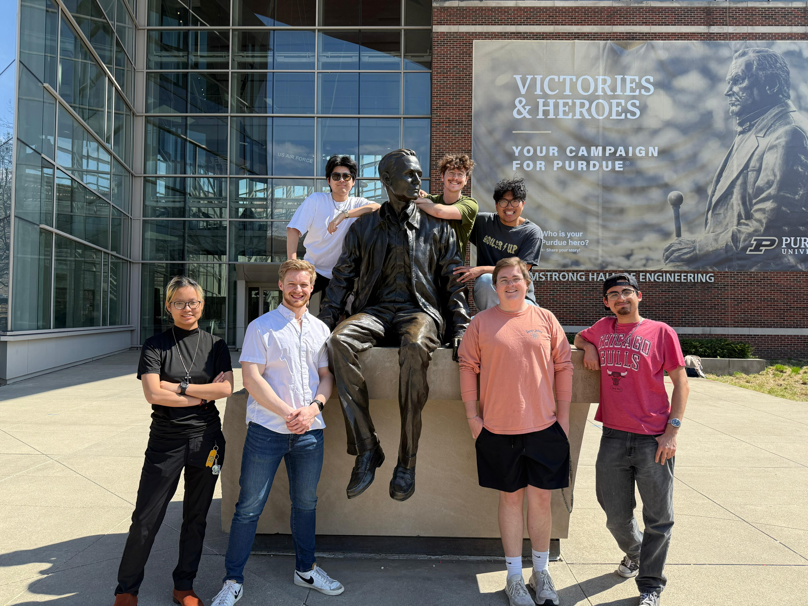

# MCC VR + AI System

## Project Overview

**MCC VR + AI System** is a Unity-based virtual reality representation of NASA's Mission Control Center (MCC) integrated with an intelligent virtual agent powered by a Retrieval-Augmented Generation (RAG) pipeline. The system is designed to support astronaut and flight controller decision-making by combining immersive mission-operations visualization with context-aware voice interaction.

The repository contains the Unity application, project assets, scripts for speech and agent interaction, packaged builds, and supporting technical documentation. The deployed AI backend architecture described below is referenced by the Unity client but is not fully checked into this repository.

## Background And Motivation

NASA mission operations depend on tightly coordinated teams managing spacecraft state, crew safety, timelines, anomalies, and communication across multiple disciplines. Within MCC, flight controllers monitor subsystem health, interpret telemetry, execute procedures, and advise the flight director under time-critical conditions.

This operating model creates several persistent challenges:

- High cognitive load caused by simultaneous monitoring, procedure recall, and anomaly response.
- Information fragmentation across flight rules, procedures, mission logs, subsystem references, and voice loops.
- Training overhead for new operators learning MCC roles, console workflows, and mission context.
- Communication constraints in deep space operations, where lunar and Mars missions introduce significant latency and reduced opportunities for real-time ground intervention.
- Growing need for onboard autonomy as crews operate farther from Earth with less immediate support.

The project explores how immersive simulation and AI-assisted retrieval can reduce operator burden, improve situational understanding, and provide a platform for future human-autonomy teaming in NASA operations.

## Problem Statement

Traditional mission support tools are effective for expert operators but often assume high familiarity with procedures, rapid context switching, and immediate access to distributed documentation. For future exploration missions, those assumptions become increasingly fragile.

The problem addressed by this project is:

> How can a virtual Mission Control environment, coupled with a context-aware AI assistant, improve mission understanding, reduce operator cognitive load, and provide timely procedural support for astronauts and flight controllers in both current and future NASA operations?

## System Description

### VR Environment

The frontend is a Unity application that recreates a NASA-inspired Mission Control environment for desktop and XR interaction. The environment is intended to support:

- Spatial understanding of MCC layout and console organization.
- Immersive familiarization for operators, trainees, and stakeholders.
- Voice-enabled interaction within a mission operations setting.

The repository includes both desktop and XR scenes under `NASA JSC/Assets/Scenes/NASA Scenes`.

### AI Agent

The AI assistant is designed to answer mission-relevant questions using a grounded response workflow:

1. Capture user speech.
2. Transcribe the utterance with Whisper-based speech-to-text.
3. Query a RAG endpoint for relevant contextual material.
4. Pass the question, retrieved context, and mission-specific prompt to an answer endpoint.
5. Convert the response to speech through a text-to-speech service.

The Unity client prompt structure emphasizes concise responses, NASA flight operations principles, and operational priorities such as crew safety, vehicle safety, and mission success.

### Interaction System

Interaction is voice-first. The current Unity implementation includes:

- Microphone capture with speech segmentation.
- Server-side transcription requests.
- RAG context retrieval before answer generation.
- Event-driven response playback through TTS.
- Desktop and XR scene support for immersive operation.

## System Architecture

The deployed system architecture is organized as follows:

```text
[User in Unity VR/Desktop]
          |
          v
[Unity Frontend]
  - VR/XR environment
  - Voice capture
  - Interaction logic
          |
          v
[FastAPI Backend on AWS]
  - /transcribe
  - /ask
  - /answer
  - /speak
          |
          +--> [Whisper STT]
          +--> [Vector Database / Embedding Retrieval]
          +--> [LLM Response Generation]
          +--> [TTS Service]
```

### Frontend

- **Unity 2022.3.14f1** application for desktop and XR deployment.
- Mission Control scene composition, UI, audio handling, and interaction logic.
- C# scripts for Whisper integration, RAG requests, AI orchestration, and speech playback.

### Backend

- **FastAPI** service architecture assumed for orchestration of transcription, retrieval, generation, and speech synthesis.
- Hosted on **AWS**, with the Unity scenes currently referencing remote HTTP endpoints.
- Supports modular AI services so retrieval and generation can evolve independently.

### Retrieval Layer

- A **vector database** stores embedded mission documents, procedures, and reference material.
- Retrieval returns context relevant to the user's question before response generation.
- This reduces hallucination risk and grounds responses in operational content.

### Speech Services

- **Whisper STT** transcribes spoken user input.
- **TTS** converts generated responses into audio for immersive conversational interaction.

## Technical Stack

### Core Platforms

- Unity `2022.3.14f1`
- C#
- FastAPI
- AWS hosting

### AI And Speech

- Retrieval-Augmented Generation (RAG)
- Vector database for semantic retrieval
- Whisper speech-to-text
- Text-to-speech pipeline

### Unity Packages Observed In This Repository

- Meta XR SDK
- OpenAI Unity integration
- ElevenLabs Unity package
- Unity XR / Oculus support
- TextMeshPro
- Universal Render Pipeline

## Methodology

The system was developed using a human-centered engineering approach grounded in mission operations use cases.

### Subject Matter Expert Engagement

- Interviews and feedback sessions with SMEs informed the mission operations framing.
- MCC roles, operator workflows, and information demands guided the interaction model.
- The assistant behavior was scoped toward procedural support, rapid orientation, and contextual explanation rather than unrestricted conversation.

### Human-Centered Design

- The VR environment was designed to support intuitive orientation and recognizable mission-control interaction patterns.
- Voice interaction was prioritized to reduce manual interface burden in immersive settings.
- The RAG architecture was selected to improve trustworthiness by grounding outputs in retrieved reference data.

## Results And Evaluation

This project demonstrates a functional proof-of-concept for combining immersive mission operations simulation with AI-assisted support.

Observed outcomes include:

- A working Unity VR/Desktop experience representing a NASA-inspired MCC environment.
- End-to-end voice workflow from speech capture through transcription, retrieval, response generation, and spoken output.
- A system architecture aligned with future decision-support use cases for astronaut and flight controller assistance.
- A platform suitable for further usability testing, retrieval benchmarking, and operational scenario evaluation.

At the current repository stage, formal quantitative evaluation data is not packaged alongside the codebase. Future assessments should measure latency, retrieval precision, task completion support, user trust, and cognitive workload reduction.

## Applications To NASA Missions

### Artemis And Cis-Lunar Operations

- Support pre-mission and on-console training in mission operations environments.
- Provide fast access to procedures, system explanations, and mission context.
- Improve familiarization with distributed mission-support workflows.

### Lunar Surface Missions

- Assist crews operating with limited ground bandwidth and delayed support.
- Provide context-aware procedural guidance for habitat, EVA, and surface systems.
- Support just-in-time information retrieval in immersive training or rehearsal settings.

### Mars Autonomy

- Extend the concept toward onboard decision support where communication delay makes real-time MCC assistance impractical.
- Enable more autonomous crew operations supported by grounded AI retrieval.
- Serve as a prototype for future human-autonomy teaming concepts in deep space exploration.

## Future Work

- Integrate the companion FastAPI backend directly into this repository or as a linked submodule.
- Replace hard-coded service URLs with environment-based runtime configuration.
- Add authenticated service access and secure secret management.
- Expand the retrieval corpus with flight rules, procedures, anomaly playbooks, and mission timelines.
- Evaluate model behavior under off-nominal mission scenarios.
- Add telemetry dashboards, console-specific AI modes, and multi-user collaborative operation.
- Perform formal human factors studies focused on workload, trust, and mission effectiveness.

## Getting Started

### Prerequisites

- Git
- Unity Hub
- Unity Editor `2022.3.14f1`
- A running companion AI backend for STT, RAG, answer generation, and TTS
- Python `3.10+` for the backend service, if you are running your own FastAPI deployment

### 1. Clone The Repository

```bash
git clone https://github.com/ChawinMin/CGT411-IXL-APL.git
cd CGT411-IXL-APL
```

### 2. Configure Environment Variables

The Unity client in this repository currently references remote endpoints in-scene. For a production-ready setup, configure the backend using environment variables in the FastAPI service.

Example `.env` for the companion backend:

```env
OPENAI_API_KEY=your_openai_api_key
AWS_REGION=us-east-1
VECTOR_DB_URL=your_vector_database_url
VECTOR_DB_API_KEY=your_vector_database_key
WHISPER_MODEL=whisper-1
TTS_PROVIDER_API_KEY=your_tts_provider_key
HOST=0.0.0.0
PORT=8000
```

### 3. Install Backend Dependencies

This repository does **not** currently include the FastAPI backend source. If you are using the companion backend described in the architecture, the typical setup is:

```bash
cd backend
python -m venv .venv
source .venv/bin/activate
pip install -r requirements.txt
```

On Windows PowerShell:

```powershell
cd backend
python -m venv .venv
.venv\Scripts\Activate.ps1
pip install -r requirements.txt
```

### 4. Run The Backend

Example FastAPI startup command:

```bash
uvicorn app.main:app --host 0.0.0.0 --port 8000 --reload
```

Expected API routes used by the Unity client:

- `POST /transcribe`
- `POST /ask`
- `POST /answer`
- `POST /speak`

### 5. Open The Unity Project

1. Open Unity Hub.
2. Add the project located at `NASA JSC/`.
3. Open the project with Unity `2022.3.14f1`.
4. Load one of the main scenes:
   - `NASA JSC/Assets/Scenes/NASA Scenes/Desktop - NASA JSC.unity`
   - `NASA JSC/Assets/Scenes/NASA Scenes/XR - NASA JSC.unity`
5. Confirm the backend endpoints are reachable before entering Play Mode.

## Folder Structure

```text
CGT411-IXL-APL/
|-- README.md
|-- .github/
|-- Addiitonal Information/
|   |-- MCC_VR_AI_APL_Final_Paper.pdf
|   `-- APLPoster.pdf
|-- Build App (Desktop)/
|-- Build App (XR)/
|-- Build App (XR Android)/
|-- Technical Documentation/
`-- NASA JSC/
    |-- Assets/
    |   |-- Scenes/
    |   |-- Scripts/
    |   |   `-- AI/
    |   |       |-- AIManager.cs
    |   |       |-- RAG.cs
    |   |       |-- Whisper.cs
    |   |       `-- ElevenLabsManager.cs
    |   `-- ...
    |-- Packages/
    `-- ProjectSettings/
```

## Repository Notes

- The Unity client is the primary implementation contained in this repository.
- Packaged desktop, XR, and Android XR builds are included for demonstration and review.
- The AI backend described in this README is an architectural component referenced by the client, but the backend source code is not presently committed here.

## Team

<p align="center"></p>

The top row from left to right is: **Ryan Ahn**, **Avery Delinger III**, **Chawin Mingsuwan**

The bottom row from left to right is: **Simon An**, **Ruseel Thomas**, **William Cromer**,**Salvador Ayala**
